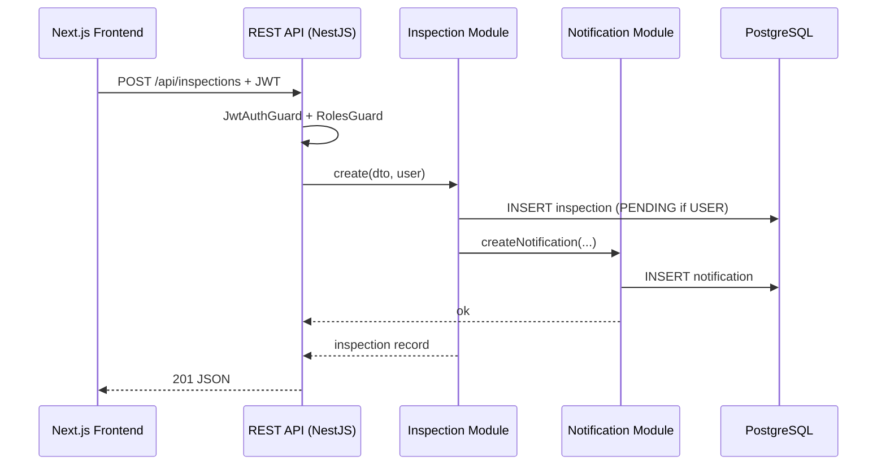

# FEMS Backend — RESTful API with Logical Service Boundaries

## What you actually built (be accurate in reports)

| Aspect | Your FEMS implementation |
|--------|--------------------------|
| **API style** | RESTful (HTTP verbs, JSON, resource URLs) |
| **Physical deployment** | **One** NestJS application (`:3001`) — a **modular monolith** |
| **Logical design** | **Seven domain modules**, each owning one business capability (same boundaries as SRS microservices) |
| **Database** | **One** PostgreSQL database (shared; not database-per-service) |
| **Communication** | In-process method calls between modules (not HTTP between services) |

**Correct wording for assignments:**  
*"The system is implemented as a **RESTful API** using a **modular monolith** architecture. Business capabilities are separated into **logical services** (NestJS modules) that correspond to the SRS microservice responsibilities, exposed through a unified API gateway and documented with OpenAPI/Swagger."*

Avoid claiming *"we deployed seven separate microservice containers"* unless you actually split them into separate processes.

---

## Logical services ↔ code ↔ REST prefix

| Logical service | NestJS module(s) | Base path | Main responsibility |
|-----------------|------------------|-----------|---------------------|
| **User & Auth** | `AuthModule`, `UsersModule` | `/api/auth`, `/api/users` | Registration, login, JWT, roles, profile, password recovery |
| **Extinguisher** | `ExtinguishersModule` | `/api/extinguishers` | Register/update/delete units, assign `ownerId`, USER sees own only |
| **Inspection** | `InspectionsModule` | `/api/inspections` | Schedule (ADMIN/INSPECTOR) or request `PENDING` (USER), approve |
| **Maintenance** | `MaintenanceModule` | `/api/maintenance` | Log maintenance; USER sees logs for owned extinguishers |
| **Reporting** | `ReportsModule` | `/api/reports` | Dashboard summary, stock, expired list, export CSV/PDF |
| **Notification** | `NotificationsModule`, `MailerModule` | `/api/notifications` | In-app notifications + email |
| **Scheduler** | `TasksModule` | (cron, no public REST) | Mark expired/overdue, send reminders |

---

## RESTful vs microservices (short definitions)

**RESTful API** = how clients talk to the server:
- Resources: `/extinguishers`, `/inspections`, `/users`
- Methods: `GET`, `POST`, `PATCH`, `DELETE`
- Stateless requests with `Authorization: Bearer <JWT>`

**Microservices** = how the **backend is deployed and scaled**:
- Each service = separate process (often separate repo/container)
- Own database optional per service
- Services call each other over network (HTTP/gRPC/message bus)

**Your project** = RESTful **+** microservice-**style** module boundaries **inside one deployable**.

---

## Request flow (one example)

---

## Diagrams in this repo

| File | Purpose |
|------|---------|
| `fems-architecture.mmd` | Full system (frontend + backend modules + DB) |
| `fems-logical-services.mmd` | **Logical microservices view** (for presentations) |
| `fems-er-diagram.mmd` | Database model |
| `fems-database.dbml` | DBML for dbdiagram.io |
